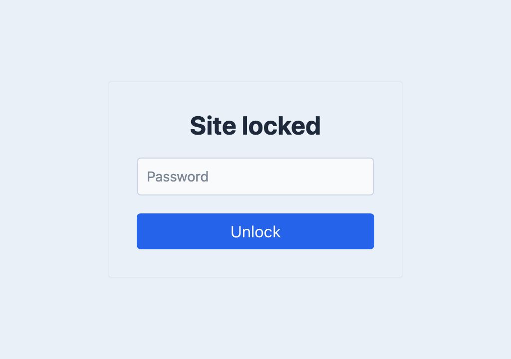

# Usage

Knock Knock places a shared-password gate in front of the protected URLs on your site. It is useful when a site is being prepared for a limited audience. Passing the gate does not sign the visitor in as a Craft user.

The gate covers ordinary page requests. Authenticated Craft users, valid preview/token requests and Craft action requests retain their existing exemptions for compatibility with logins, forms, webhooks and other integrations. Treat those endpoints as separate application surfaces and apply their own authentication and authorization where required.

In the plugin settings, set a password and enable protection. Start with the default gate before creating a custom template. Open a protected page in a fresh browser session, enter an incorrect password to check the error, then enter the configured password and confirm that you reach the page.



Use `protectedUrls` and `unprotectedUrls` in [Configuration](docs:get-started/configuration) when only part of the site needs the gate. Test a URL from each group, including any public endpoint that must remain reachable. Check from an IP that is not exempted by `allowIps`; an allowed address will not demonstrate the visitor's password prompt.

<span id="security"></span>

## Login Attempt Checks
You can opt to log users' attempts to login to Craft to prevent brute-force attempts. Use the `checkInvalidLogins` [configuration setting](docs:get-started/configuration) to manage this.

**Important:** You must also enable [storeUserIps](https://craftcms.com/docs/5.x/reference/config/general.html#storeuserips) in your `general.php` file.

## Custom Template
Using the `template` [configuration setting](docs:get-started/configuration), you can provide a path to your own custom template, shown to users when they try to login. A very simple example might look like the following:

```twig
<form method="post" accept-charset="utf-8">
    <input type="hidden" name="action" value="knock-knock/default/answer">
    {{ csrfInput() }}

    <label for="password">Password</label>
    <input id="password" type="password" name="password" autocomplete="off" placeholder="Password" autofocus />

    <button type="submit" name="unlock" value="Unlock">Unlock</button>

    
        <ul class="errors">
            
                <li>{{ error }}</li>
            
        </ul>
    
</form>
```

You can also look at the template Knock Knock itself uses [here](https://github.com/verbb/knock-knock/blob/craft-5/src/templates/ask.html). When using a custom template, include the action and CSRF inputs shown above, and keep the password field’s `name` attribute. Knock Knock tracks the destination server-side, so a redirect input is not required. Otherwise, you have complete control over the look and feel of this form.
