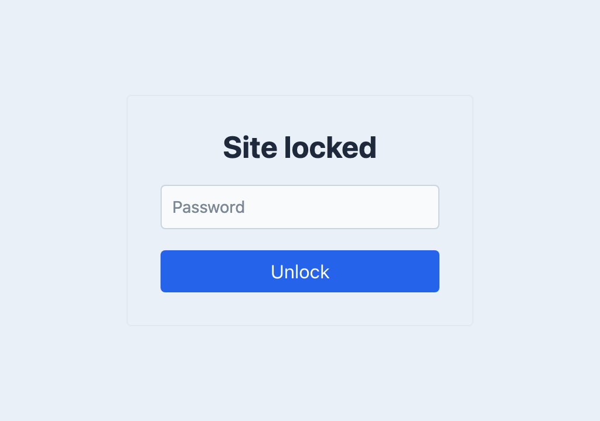

<!-- feature-intro -->
Knock Knock places a simple shared-password gate in front of a Craft site. Protect a staging site, private preview, or work in progress without building a complete member system.
<!-- feature-intro-end -->

<!-- feature-section media-size="medium" -->
## Shared password protection

Visitors enter one project password before accessing protected pages. Successful access is remembered for the configured period, making the gate useful for client review without creating and maintaining individual Craft accounts.

<!-- feature-section-end -->

<!-- feature-grid -->
- :icon[route] **Route exceptions** Leave selected endpoints available when integrations or public pages need them.
- :icon[network] **IP bypass** Allow trusted networks through without the password screen.
- :icon[template] **Custom presentation** Use project-owned templates or responses for the gate.
- :icon[world] **Per-site protection** Use different passwords, templates and enabled states across a multi-site project.
- :icon[layout-dashboard] **Control panel protection** Put the same shared-password gate in front of Craft when a project needs it.
- :icon[shield-lock] **Login throttling** Temporarily block an IP after too many invalid password attempts.
<!-- feature-grid-end -->
